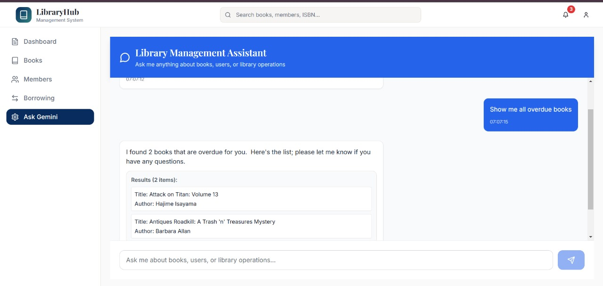
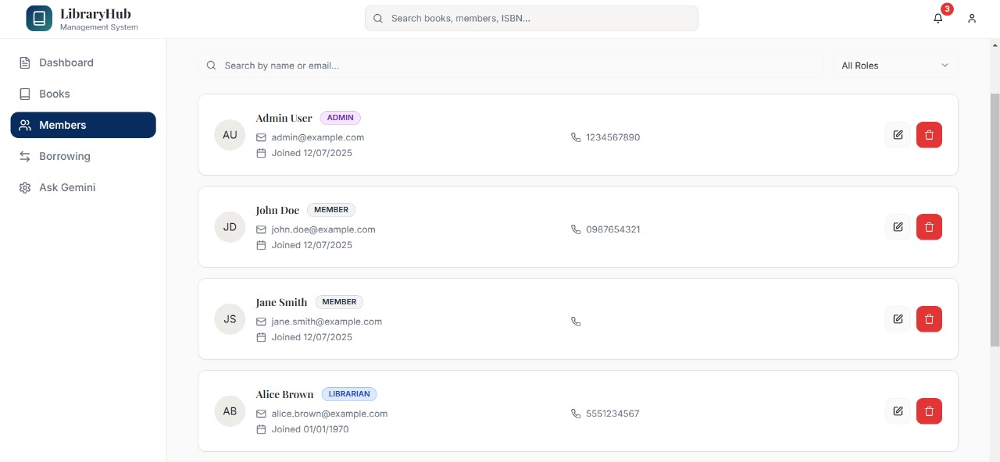
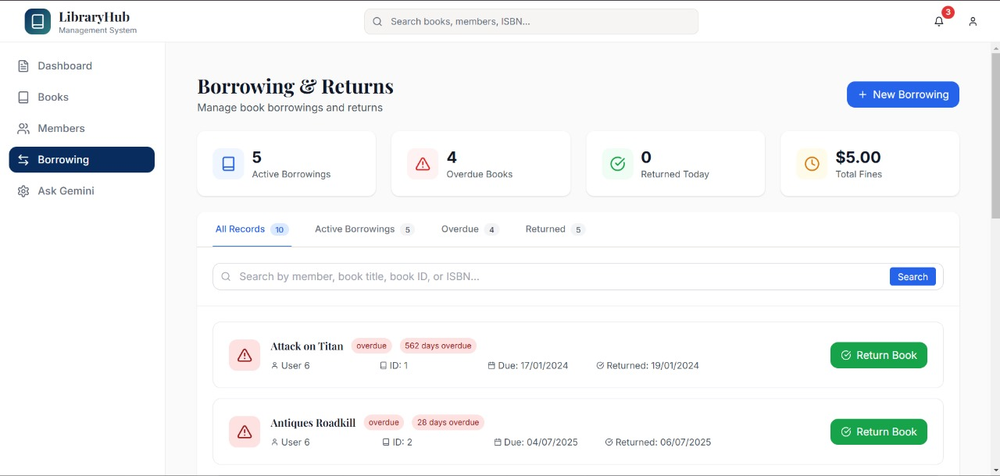

# 📚 LMS - Library Management System

A modern, full-stack Library Management System built with Spring Boot and React, featuring AI-powered natural language database queries using Google Gemini API.

## 🌟 Features

### Core Functionality
- **Book Management**: Add, update, delete, and search books
- **User Management**: Manage library members and staff
- **Borrowing System**: Issue and return books with due date tracking
- **Real-time Inventory**: Live updates of book availability
- **Search**: search capabilities across multiple parameter

### AI-Powered Features
- **Natural Language Queries**: Ask questions in plain English like "Show me overdue books" or "Find books by author John Doe"

## 🛠️ Tech Stack

### Backend
- **Java 17**
- **Spring Boot 3.2.5**
- **Spring Data JPA**
- **Spring Security**
- **PostgreSQL**
- **Google Gemini API**

### Frontend
- **React 18**
- **JavaScript**
- **Axios** for API calls
- **React Router** for navigation

### Development Tools
- **Maven** for dependency management
- **Postman** for API testing
- **VS Code & IntelliJ** for development

## 📸 Screenshots

### Main Dashboard

*Overview of library statistics and quick actions*

### Book Management

*Add, edit, and manage book inventory*

### AI Chat Interface

*Natural language database queries using Google Gemini API*

### AI Chat Interface Example

*Natural language database queries using Google Gemini API Example*

### User Management

*Manage library members and staff*

### Borrowing System

*Issue and return books with tracking*


## 📁 Project Structure

```
lms-library-management/
├── backend/
│   ├── src/main/java/com/lms/
│   │   ├── controller/          # REST API controllers
│   │   ├── service/             # Business logic
│   │   ├── repository/          # Data access layer
│   │   ├── model/               # Entity classes
│   │   ├── dto/                 # Data transfer objects
│   │   ├── config/              # Configuration classes
│   │   └── security/            # Security configuration
│   └── src/main/resources/
│       ├── application.properties
│              
├── frontend/
│   ├── src/
│   │   ├── components/          # Reusable components
│   │   ├── pages/               # Page components
│   │   ├── services/            # API service functions
│   │   ├── utils/               # Utility functions
│   │   └── styles/              # CSS files
│   └── public/
└── screenshots/                 # Application screenshots
```

## 🔌 API Endpoints

### Books
- `GET /api/books` - Get all books
- `GET /api/books/{id}` - Get book by ID
- `POST /api/books` - Add new book
- `PUT /api/books/{id}` - Update book
- `DELETE /api/books/{id}` - Delete book

### Users
- `GET /api/users` - Get all users
- `POST /api/users` - Register new user
- `PUT /api/users/{id}` - Update user
- `DELETE /api/users/{id}` - Delete user

### Borrowing
- `POST /api/borrow` - Borrow a book
- `POST /api/return` - Return a book
- `GET /api/borrowed/{userId}` - Get user's borrowed books

### AI Chat
- `POST /api/chat/query` - Send natural language query


### AI-Powered Natural Language Queries
The system integrates Google Gemini API to convert natural language questions into SQL queries:

```javascript
// Example queries you can ask:
"Show me all overdue books"
"Find books published after 2020"
"Which users have borrowed the most books?"
"List available books in the Science category"
```


